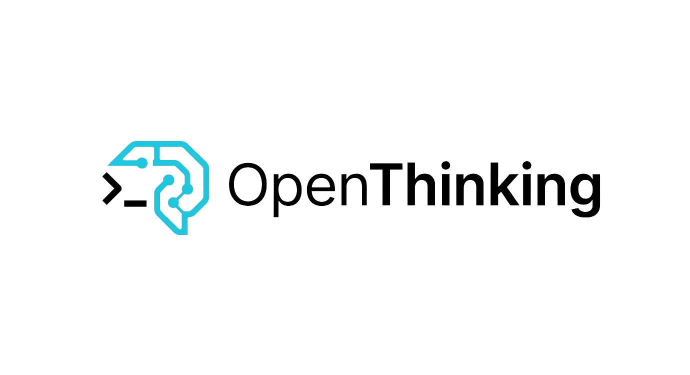

<p align="center">
  
</p>

<h1 align="center">OpenThinking</h1>

<p align="center">
  El primer framework de orquestación de agentes multi-LLM para construir pipelines, orchestrators y workflows colaborativos de IA.
</p>

<p align="center">
  Construye sistemas multi-LLM con contexto compartido, políticas de acceso y skills reutilizables sobre cualquier proveedor.
</p>

<p align="center">
  <a href="https://www.npmjs.com/package/openthk">
    
  </a>
  <a href="./LICENSE">
    
  </a>
  <a href="https://nodejs.org/">
    = 20" />
  </a>
  
</p>

<p align="center">
  <a href="#instalación">Instalar</a> •
  <a href="#inicio-rápido">Inicio rápido</a> •
  <a href="#características">Características</a> •
  <a href="#arquitectura">Arquitectura</a> •
  <a href="https://github.com/sicora-dev/Open-Thinking">Repositorio</a>
</p>

<p align="center">
  <a href="./README.md">English</a> • Español • <a href="./README.fr.md">Français</a>
</p>

---

```yaml
# openthk.pipeline.yaml
name: feature-development
version: "1.0"

providers:
  - anthropic
  - openai

stages:
  planning:
    provider: anthropic
    model: claude-opus-4-5-20250520
    skill: core/arch-planner@1.0
    context:
      read: ["input.*"]
      write: ["plan.*"]

  develop:
    provider: openai
    model: gpt-4o
    skill: core/code-writer@1.0
    context:
      read: ["input.*", "plan.*"]
      write: ["code.*"]
    depends_on: [planning]

  testing:
    provider: anthropic
    model: claude-sonnet-4-20250514
    skill: core/test-gen@1.0
    context:
      read: ["plan.*", "code.*"]
      write: ["test.*"]
    depends_on: [develop]
```

## Tabla de contenidos

- [Características](#características)
- [Requisitos](#requisitos)
- [Instalación](#instalación)
- [Inicio rápido](#inicio-rápido)
- [Referencia de la CLI](#referencia-de-la-cli)
  - [REPL interactiva](#repl-interactiva)
  - [Comandos directos](#comandos-directos)
  - [Comandos slash de la REPL](#comandos-slash-de-la-repl)
- [Configuración del pipeline](#configuración-del-pipeline)
  - [Esquema YAML completo](#esquema-yaml-completo)
  - [Modos de ejecución](#modos-de-ejecución)
  - [Resolución de proveedores](#resolución-de-proveedores)
  - [Namespaces del contexto](#namespaces-del-contexto)
  - [Gestión de fallos](#gestión-de-fallos)
- [Proveedores](#proveedores)
  - [Proveedores compatibles](#proveedores-compatibles)
  - [Configuración de proveedores](#configuración-de-proveedores)
  - [Proveedores personalizados](#proveedores-personalizados)
  - [Resiliencia de proveedores](#resiliencia-de-proveedores)
- [Skills](#skills)
  - [Estructura de una skill](#estructura-de-una-skill)
  - [Manifest de la skill](#manifest-de-la-skill)
  - [Permisos de herramientas](#permisos-de-herramientas)
  - [Skills integradas](#skills-integradas)
- [Herramientas integradas](#herramientas-integradas)
- [Bucle de agente](#bucle-de-agente)
- [Almacén de contexto](#almacén-de-contexto)
- [Motor de políticas](#motor-de-políticas)
- [Estructura del workspace](#estructura-del-workspace)
- [Arquitectura](#arquitectura)
- [Desarrollo](#desarrollo)
- [Licencia](#licencia)

## Características

- **Orquestación multi-LLM** — Asigna modelos distintos a distintas etapas. Opus planifica, GPT-4o programa y Sonnet prueba.
- **Dos modos de ejecución** — Secuencial (DAG con etapas independientes en paralelo) u orchestrated (un LLM delega dinámicamente en agentes).
- **Almacén de contexto compartido** — Store clave-valor sobre SQLite con control de acceso por namespaces. Las etapas declaran qué pueden leer y escribir.
- **18+ proveedores** — OpenAI, Anthropic, Google, Mistral, xAI, DeepSeek, Groq, Together, Fireworks, OpenRouter, Perplexity, Cohere, Azure, Bedrock, Ollama, LM Studio, llama.cpp.
- **Skills reutilizables** — Empaqueta prompts y permisos de herramientas como definiciones portables de skills. Usa las integradas o crea las tuyas.
- **Políticas declarativas** — Límites de tasa, topes de coste y auditoría definidos en el YAML del pipeline.
- **Resiliencia de proveedores** — Backoff exponencial con jitter, rate limiting mediante token bucket y cadenas de fallback de modelos cuando se agotan los reintentos por rate limit.
- **REPL interactiva** — Ejecuta `openthk` para abrir un shell interactivo con slash commands, tab completion y ejecución de pipelines en lenguaje natural.
- **CLI amigable con gestores de paquetes** — Instálala con `npm`, `pnpm` o `bun`. Opcionalmente puedes compilar un binario standalone para distribución local.

## Requisitos

- Node.js >= 20
- macOS o Linux
- [Bun](https://bun.sh) >= 1.1.0 para desarrollo local y builds de release

## Instalación

```bash
# Instalación global
bun install -g openthk
npm install -g openthk
pnpm add -g openthk

# Ejecución puntual
bunx openthk --help
npx openthk --help
pnpm dlx openthk --help

# Desde el código fuente
git clone https://github.com/sicora-dev/Open-Thinking.git
cd Open-Thinking
bun install
bun run build         # CLI del paquete npm -> dist/cli/index.cjs
bun run build:binary  # binario standalone opcional -> dist/openthk
```

## Inicio rápido

```bash
# 1. Inicializa un proyecto nuevo
openthk init my-project
cd my-project

# 2. Configura tus proveedores LLM (wizard interactivo con navegación por flechas)
openthk
# luego, dentro de la REPL:
/providers setup

# 3. Escribe un prompt para ejecutar el pipeline por defecto
> Build a REST API for a todo app with CRUD endpoints
```

O ejecuta un pipeline directamente sin entrar en la REPL:

```bash
openthk run -p openthk.pipeline.yaml -i "Build a REST API for a todo app"
```

## Referencia de la CLI

### REPL interactiva

```bash
openthk
```

Abre un shell interactivo. Escribe lenguaje natural para ejecutar el pipeline cargado, o usa slash commands para configurar proveedores, inspeccionar etapas y gestionar pipelines.

La REPL resuelve automáticamente un pipeline al arrancar en este orden:

1. Pipeline activo configurado mediante `/pipeline switch <name>`
2. Pipeline por defecto configurado mediante `/pipeline default <name>`
3. Auto-detección de `openthk.pipeline.yaml` o `pipeline.yaml` en el directorio actual

### Comandos directos

#### `openthk init [name]`

Crea el scaffold de un proyecto nuevo.

```bash
openthk init my-project    # Crear en un directorio nuevo
openthk init               # Inicializar en el directorio actual
```

Crea:
- `.openthk/pipelines/default.yaml` — Plantilla inicial del pipeline
- `.openthk/project.md` — Descripción del proyecto (contexto compartido para todas las etapas)
- `.openthk/stages/` — Instrucciones por etapa
- `.openthk/history/` — Logs del historial de ejecuciones
- `.openthk/learned/` — Aprendizajes de ejecuciones anteriores
- `skills/` — Definiciones locales de skills
- `openthk.pipeline.yaml` — Archivo raíz del pipeline (compatibilidad hacia atrás)

#### `openthk run`

Ejecuta un pipeline.

```bash
openthk run -p <path> -i <prompt> [options]
```

| Flag | Descripción |
|---|---|
| `-p, --pipeline <path>` | Ruta al archivo YAML del pipeline (obligatorio) |
| `-i, --input <text>` | Prompt de entrada para el pipeline (obligatorio) |
| `-s, --stage <name>` | Ejecutar solo una etapa |
| `--dry-run` | Mostrar el plan de ejecución sin ejecutarlo |
| `--skills-dir <path>` | Directorio de skills (por defecto: `skills/` junto al pipeline) |

Ejemplos:

```bash
# Ejecutar el pipeline completo
openthk run -p openthk.pipeline.yaml -i "Build a REST API for user management"

# Ejecutar una sola etapa
openthk run -p pipeline.yaml -i "Write unit tests" --stage testing

# Previsualizar el plan de ejecución
openthk run -p pipeline.yaml -i "Refactor auth module" --dry-run
```

#### `openthk validate`

Valida un archivo YAML de pipeline sin ejecutarlo.

```bash
openthk validate [-f <path>]
```

| Flag | Descripción |
|---|---|
| `-f, --file <path>` | Ruta al archivo del pipeline (por defecto: `openthk.pipeline.yaml`) |

Comprueba: sintaxis YAML, campos obligatorios, grafo de dependencias entre etapas (dependencias circulares), referencias a proveedores y configuración de políticas.

#### `openthk provider`

Gestiona proveedores desde la CLI directa.

```bash
# Listar proveedores definidos en un pipeline
openthk provider list [-f <path>]

# Probar la conexión de un proveedor
openthk provider test <name> [-f <path>]
```

| Subcomando | Descripción |
|---|---|
| `list` | Lista todos los proveedores del pipeline con sus base URLs resueltas |
| `test <name>` | Envía una petición de prueba para verificar que el proveedor es accesible y que la API key funciona |

#### `openthk context`

Gestiona el almacén de contexto compartido.

```bash
# Inspeccionar todas las entradas (o filtrar por prefijo)
openthk context inspect [-p <prefix>] [-d <db-path>]

# Limpiar todo el contexto
openthk context clear -y [-d <db-path>]
```

| Flag | Descripción |
|---|---|
| `-p, --prefix <prefix>` | Filtrar entradas por prefijo de clave (por ejemplo, `plan.`) |
| `-d, --db <path>` | Ruta de la base de datos (por defecto: `.openthk/context.db`) |
| `-y, --yes` | Saltar la confirmación al limpiar |

### Comandos slash de la REPL

| Comando | Aliases | Descripción |
|---|---|---|
| `/help` | `/h`, `/?` | Mostrar todos los comandos disponibles |
| `/pipeline` | `/p` | Mostrar el diseño del pipeline actual (etapas, dependencias, modelos) |
| `/pipeline list` | | Listar todos los pipelines disponibles (a nivel de proyecto + usuario) |
| `/pipeline switch <name>` | | Cambiar a otro pipeline |
| `/pipeline add <path> [project\|user]` | | Registrar un archivo YAML de pipeline |
| `/pipeline remove <name> [project\|user]` | | Eliminar un pipeline registrado |
| `/pipeline default <name> <project\|user\|clear>` | | Configurar o limpiar el pipeline por defecto |
| `/pipeline load <path>` | | Cargar un YAML de pipeline desde una ruta |
| `/pipeline refresh [name]` | | Recargar un pipeline desde disco |
| `/providers setup` | | Wizard interactivo para configurar proveedores (navegación con flechas) |
| `/providers list` | `/provider list` | Listar todas las API keys configuradas globalmente |
| `/providers remove <id>` | `/provider rm <id>` | Eliminar la API key de un proveedor |
| `/model` | `/m` | Mostrar la asignación de modelo por etapa |
| `/stages` | `/s` | Mostrar el grafo de dependencias entre etapas |
| `/skills` | | Listar las skills disponibles en el directorio de skills |
| `/context inspect` | `/ctx inspect` | Mostrar las entradas del almacén de contexto |
| `/context clear` | `/ctx clear` | Limpiar el almacén de contexto |
| `/clear` | | Limpiar la terminal |
| `/exit` | `/quit`, `/q` | Salir de la REPL |

## Configuración del pipeline

### Esquema YAML completo

```yaml
name: string                    # Nombre del pipeline (obligatorio)
version: string                 # Versión semver (obligatorio)
mode: sequential | orchestrated # Modo de ejecución (por defecto: sequential)

context:                        # Opcional — se muestran los valores por defecto
  backend: sqlite | postgres    # Backend de almacenamiento (por defecto: sqlite)
  vector: embedded | qdrant     # Backend de búsqueda vectorial (por defecto: embedded)
  ttl: string                   # Expiración del contexto (por defecto: "7d")

providers:                      # Obligatorio — al menos uno
  - openai                      # Nombre del catálogo → se resuelve automáticamente
  - anthropic
  - ollama
  - id: my-custom               # Proveedor personalizado (no está en el catálogo)
    base_url: https://api.example.com/v1
    api_key: ${MY_API_KEY}      # Interpolación de variable de entorno

stages:                         # Obligatorio — al menos una
  [stage_name]:
    provider: string            # Debe coincidir con un nombre de la lista providers (obligatorio)
    model: string               # Identificador del modelo (obligatorio)
    skill: string               # Referencia a la skill: namespace/name@version
    context:
      read: string[]            # Patrones glob para claves de contexto legibles
      write: string[]           # Patrones glob para claves de contexto escribibles
    depends_on: string[]        # Dependencias de la etapa (modo sequential)
    max_tokens: number          # Máx. tokens de salida por petición al LLM
    temperature: number         # Temperatura de muestreo (0–2)
    timeout: number             # Timeout de petición en segundos (por defecto: 120)
    max_iterations: number      # Máx. iteraciones del agent loop (por defecto: 50)
    role: orchestrator          # Marca la etapa como orchestrator (solo modo orchestrated)
    allowed_tools: string[]     # Sobrescribe los permisos de herramientas por defecto de la skill
    fallback_models: string[]   # Modelos fallback al agotar rate limit
    on_fail:
      retry_stage: string       # Etapa a reejecutar al fallar
      max_retries: number       # Máx. intentos de reintento
      inject_context: string    # Clave de contexto donde inyectar los detalles del fallo

policies:                       # Opcional
  global:
    rate_limit: string          # Límite de tasa por etapa (por ejemplo, "100/hour")
    audit_log: boolean          # Activar auditoría
    cost_limit: string          # Tope de coste por ejecución (por ejemplo, "$50/run")
```

### Modos de ejecución

#### Secuencial (por defecto)

Las etapas se ejecutan en el orden definido por `depends_on`. Las etapas independientes (sin dependencias compartidas) se ejecutan en paralelo.

```yaml
stages:
  planning:
    provider: anthropic
    model: claude-sonnet-4-20250514
    # sin depends_on → se ejecuta primero

  develop:
    provider: openai
    model: gpt-4o
    depends_on: [planning]       # espera a planning

  lint:
    provider: openai
    model: gpt-4o-mini
    depends_on: [planning]       # también espera a planning, pero va en paralelo con develop

  testing:
    provider: anthropic
    model: claude-sonnet-4-20250514
    depends_on: [develop, lint]  # espera a ambas
```

Plan de ejecución:
```
Layer 1:  planning
Layer 2:  develop, lint          (parallel)
Layer 3:  testing
```

#### Orquestado

Una etapa se marca como `role: orchestrator`. Recibe una herramienta `delegate` y decide dinámicamente qué agentes invocar y en qué orden. Todas las demás etapas quedan disponibles como agentes.

```yaml
mode: orchestrated

stages:
  orchestrator:
    provider: anthropic
    model: claude-opus-4-5-20250520
    role: orchestrator
    skill: core/orchestrator@1.0
    context:
      read: ["*"]
      write: ["orchestrator.*"]
    timeout: 600

  architect:
    provider: anthropic
    model: claude-sonnet-4-20250514
    skill: core/arch-planner@1.0
    context:
      read: ["input.*", "*.output"]
      write: ["architect.*"]
    allowed_tools: [read_file, list_files, search_files]

  coder:
    provider: openai
    model: gpt-4o
    skill: core/code-writer@1.0
    context:
      read: ["input.*", "architect.*"]
      write: ["code.*"]

  tester:
    provider: openai
    model: gpt-4o
    skill: core/test-writer@1.0
    context:
      read: ["*"]
      write: ["test.*"]
```

El orchestrator llama a los agentes mediante la herramienta `delegate`:

```
delegate(agent: "architect", task: "Analyze the requirements and propose a database schema")
→ ejecuta el agent loop completo del architect
→ la salida se guarda en el contexto como architect.output
→ el orchestrator lee el resultado y decide el siguiente paso

delegate(agent: "coder", task: "Implement the schema from the architect's plan")
→ ejecuta el agent loop completo del coder
→ ...
```

Los agentes pueden invocarse varias veces con tareas distintas. Cada agente respeta su propia skill, sus herramientas y sus permisos de contexto.

### Resolución de proveedores

Los proveedores en el YAML se declaran como nombres. El parser los resuelve automáticamente:

1. **Base URL** — Se busca en el catálogo integrado de proveedores (`src/config/provider-catalog.ts`)
2. **API key** — Se busca en `~/.openthk/providers.json` (configurado mediante `/providers setup`)
3. **Fallback** — Si no está en la configuración global, revisa la variable de entorno (por ejemplo, `OPENAI_API_KEY`)

Los usuarios nunca necesitan escribir `type`, `base_url` o `api_key` en el YAML para proveedores conocidos.

Los proveedores personalizados que no están en el catálogo usan la forma de objeto:

```yaml
providers:
  - id: my-llm
    base_url: https://api.example.com/v1
    api_key: ${MY_LLM_KEY}
```

### Namespaces del contexto

Las claves usan notación por puntos. Las etapas declaran acceso de lectura/escritura con patrones glob.

| Patrón | Coincide con |
|---|---|
| `input.*` | `input.prompt`, `input.files`, etc. |
| `plan.*` | `plan.architecture`, `plan.decisions`, etc. |
| `code.*` | `code.files`, `code.summary`, etc. |
| `test.*` | `test.results`, `test.failures`, etc. |
| `*.output` | `architect.output`, `coder.output`, etc. |
| `*` | Todo |

Si una etapa intenta leer o escribir fuera de los patrones declarados, recibe un error de política duro.

### Gestión de fallos

```yaml
stages:
  testing:
    provider: openai
    model: gpt-4o
    on_fail:
      retry_stage: develop      # Reejecutar la etapa develop
      max_retries: 3            # Hasta 3 reintentos
      inject_context: test.failures  # Pasar detalles del fallo a la etapa reintentada
```

Cuando una etapa falla, el ejecutor puede volver a ejecutar una etapa anterior inyectando el contexto del fallo, creando un bucle de feedback.

## Proveedores

### Proveedores compatibles

**Cloud**:

| ID | Proveedor | Modelos de ejemplo |
|---|---|---|
| `openai` | OpenAI | `gpt-4o`, `gpt-4o-mini`, `o1`, `o3-mini` |
| `anthropic` | Anthropic | `claude-opus-4-5-20250520`, `claude-sonnet-4-20250514`, `claude-haiku-4-5-20251001` |
| `google` | Google AI | `gemini-2.5-pro`, `gemini-2.5-flash` |
| `mistral` | Mistral AI | `mistral-large-latest`, `codestral-latest` |
| `xai` | xAI | `grok-3`, `grok-3-mini` |
| `deepseek` | DeepSeek | `deepseek-chat`, `deepseek-reasoner` |
| `groq` | Groq | `llama-3.3-70b-versatile`, `mixtral-8x7b-32768` |
| `together` | Together AI | `meta-llama/Llama-3-70b-chat-hf` |
| `fireworks` | Fireworks AI | `accounts/fireworks/models/llama-v3p1-70b-instruct` |
| `openrouter` | OpenRouter | Cualquier modelo mediante una API unificada |
| `perplexity` | Perplexity | `sonar-pro`, `sonar` |
| `cohere` | Cohere | `command-r-plus`, `command-r` |

**Infraestructura cloud**:

| ID | Proveedor | Notas |
|---|---|---|
| `azure` | Azure OpenAI | Despliegues empresariales de OpenAI |
| `bedrock` | AWS Bedrock | Claude, Llama y Titan a través de AWS |

**Local**:

| ID | Proveedor | URL por defecto |
|---|---|---|
| `ollama` | Ollama | `http://localhost:11434` |
| `lmstudio` | LM Studio | `http://localhost:1234/v1` |
| `llamacpp` | llama.cpp | `http://localhost:8080/v1` |

### Configuración de proveedores

Las API keys se almacenan globalmente en `~/.openthk/providers.json` (permisos del archivo: `0o600`). Persisten entre todos los proyectos.

```bash
# Configuración interactiva (recomendada)
openthk
/providers setup
# → selección de proveedores con flechas
# → introducción de API key (oculta con viñetas)

# Listar proveedores configurados
/providers list

# Eliminar un proveedor
/providers remove openai
```

También puedes configurar las API keys mediante variables de entorno:

```bash
export OPENAI_API_KEY=sk-...
export ANTHROPIC_API_KEY=sk-ant-...
```

Orden de resolución: configuración global (`~/.openthk/providers.json`) > variable de entorno.

### Proveedores personalizados

Cualquier API compatible con OpenAI puede usarse como proveedor personalizado:

```yaml
providers:
  - id: my-llm
    base_url: https://api.example.com/v1
    api_key: ${MY_LLM_KEY}

stages:
  coder:
    provider: my-llm
    model: my-model-name
```

### Resiliencia de proveedores

Todas las llamadas a proveedores incluyen resiliencia integrada:

**Retry con backoff** — Las peticiones fallidas se reintentan con backoff exponencial y jitter. Condiciones reintentables: HTTP 429 (rate limit), 502/503 (errores del servidor), errores de red (ETIMEDOUT, ECONNRESET). Se respeta la cabecera `Retry-After` cuando está presente.

| Ajuste | Valor por defecto |
|---|---|
| Máx. reintentos | 3 |
| Retraso base | 1s |
| Retraso máximo | 60s |
| Jitter | 500ms |

**Rate limiting** — Un algoritmo token-bucket limita las peticiones por proveedor para evitar errores 429 de forma proactiva. Cada proveedor tiene su propio bucket, que se rellena continuamente.

**Fallback de modelos** — Cuando un modelo entra en rate limit y se agotan todos los reintentos, el ejecutor prueba el siguiente modelo de la cadena `fallback_models`:

```yaml
stages:
  coder:
    provider: openai
    model: gpt-4o
    fallback_models:
      - gpt-4o-mini
      - gpt-3.5-turbo
```

**Seguimiento de tokens** — Los tokens de prompt y completion se acumulan por etapa para calcular costes y aplicar políticas.

## Skills

### Estructura de una skill

Una skill es un directorio con dos archivos:

```
skills/core/arch-planner/
├── prompt.md       # Prompt de sistema enviado al LLM
└── skill.yaml      # Manifest: metadatos, permisos de herramientas, restricciones
```

El `prompt.md` se inyecta como system prompt para la etapa. El `skill.yaml` declara qué herramientas necesita la skill y qué claves de contexto lee y escribe.

### Manifest de la skill

```yaml
name: arch-planner
version: "1.0"
description: Analiza los requisitos y produce un plan técnico de arquitectura.

context:
  reads: ["input.*"]
  writes: ["planner.*"]

# Permisos de herramientas — se aplican a nivel del registro.
# Si una herramienta no está listada, el LLM no puede invocarla.
allowed_tools:
  - read_file
  - list_files
  - search_files

constraints:
  min_tokens: 4000
  recommended_models: [claude-opus-4-5-20250520, gpt-4o]
```

### Permisos de herramientas

No hay tipos de etapa hardcodeados. Cada autor de una skill decide qué puede hacer su skill. El acceso a herramientas se aplica a nivel del tool registry: si una herramienta no está en la lista permitida, el LLM no puede invocarla aunque la pida.

**Orden de resolución** (la primera coincidencia gana):

1. `allowed_tools` en el YAML del pipeline — Override del usuario, control total
2. `allowed_tools` en `skill.yaml` — Valor por defecto del autor de la skill
3. Todas las herramientas — Fallback si ninguna de las dos lo define

Ejemplo de override en el pipeline:

```yaml
stages:
  coder:
    skill: core/code-writer@1.0
    allowed_tools: [read_file, list_files]   # restringe: sin write_file ni run_command
```

### Skills integradas

| Skill | Descripción | Herramientas por defecto |
|---|---|---|
| `core/arch-planner@1.0` | Analiza requisitos y produce un plan técnico | `read_file`, `list_files`, `search_files` |
| `core/code-writer@1.0` | Implementa código a partir de un plan | `read_file`, `write_file`, `list_files`, `run_command`, `search_files` |
| `core/test-writer@1.0` | Genera tests para el código implementado | `read_file`, `write_file`, `list_files`, `run_command`, `search_files` |
| `core/orchestrator@1.0` | Orquesta workflows multi-agente | `delegate` (inyectada automáticamente) |

## Herramientas integradas

Cada etapa del agent loop tiene acceso a estas herramientas de filesystem (sujeto a los permisos de la skill):

### `read_file`

Lee el contenido de un archivo.

| Parámetro | Tipo | Descripción |
|---|---|---|
| `path` | string | Ruta al archivo relativa a la raíz del proyecto |

Devuelve el contenido del archivo como string. Los archivos de más de 100KB se truncan. Se bloquea el path traversal fuera de la raíz del proyecto.

### `write_file`

Crea o sobrescribe un archivo.

| Parámetro | Tipo | Descripción |
|---|---|---|
| `path` | string | Ruta al archivo relativa a la raíz del proyecto |
| `content` | string | Contenido del archivo |

Crea automáticamente los directorios padre. Devuelve el número de bytes escritos.

### `list_files`

Lista archivos y directorios.

| Parámetro | Tipo | Por defecto | Descripción |
|---|---|---|---|
| `path` | string | `.` | Directorio a listar |
| `recursive` | boolean | `false` | Recorrer subdirectorios |

Devuelve rutas separadas por saltos de línea. Los directorios llevan sufijo `/`. Omite `node_modules` y `.git`. Limitado a 500 entradas.

### `run_command`

Ejecuta un comando de shell.

| Parámetro | Tipo | Por defecto | Descripción |
|---|---|---|---|
| `command` | string | — | Comando de shell a ejecutar |
| `timeout_ms` | number | `30000` | Timeout en milisegundos |

Devuelve `stdout` y `stderr` combinados. La salida se trunca a 50KB. Se ejecuta en el directorio de trabajo del proyecto.

### `search_files`

Busca en el contenido de archivos usando regex.

| Parámetro | Tipo | Por defecto | Descripción |
|---|---|---|---|
| `pattern` | string | — | Expresión regular a buscar |
| `path` | string | `.` | Directorio donde buscar |
| `glob` | string | — | Filtro de archivos (por ejemplo, `*.ts`, `*.py`) |

Devuelve coincidencias en formato `path:line_number: matched_line`. Limitado a 100 coincidencias.

### `delegate` (solo modo orchestrated)

Invoca dinámicamente una etapa-agente. Solo está disponible para el orchestrator.

| Parámetro | Tipo | Descripción |
|---|---|---|
| `agent` | string | Nombre de la etapa que se quiere invocar |
| `task` | string | Descripción de la tarea / prompt |

Ejecuta el agent loop completo del agente y devuelve su salida final. La salida también se escribe en el almacén de contexto bajo `<agent>.output`.

## Bucle de agente

Cada etapa ejecuta un bucle iterativo de agente: envía un prompt al LLM, ejecuta las tool calls que este devuelva, retroalimenta los resultados y repite hasta que el LLM deje de pedir herramientas o se alcance un límite.

### Eficiencia de tokens

**Memoria de trabajo** — En lugar de acumular todo el historial de mensajes (que crece cuadráticamente en tokens), el loop mantiene una working memory comprimida (action log + model notes). Antes de cada llamada al LLM, el contexto se reconstruye como `[task + working memory] + [last exchange only]`.

**Truncado de salidas de herramientas** — Las salidas grandes (>2000 líneas o 50KB) se truncan a las primeras 200 líneas + las últimas 100 líneas con un aviso de omisión. Esto evita que un único `run_command` o `read_file` consuma toda la ventana de contexto.

### Mecanismos de seguridad

**Detección de doom loops** — Si el LLM hace 3 tool calls idénticas consecutivas, el loop devuelve el resultado cacheado en vez de reejecutarlo, rompiendo bucles infinitos.

**Soft stop** — Cuando `max_iterations` se aproxima al límite, el loop activa una secuencia de cierre que pide al modelo resumir su trabajo y detenerse limpiamente, evitando una terminación abrupta a mitad de tarea.

**Cancelación** — Ctrl+C durante la ejecución del pipeline propaga un `AbortSignal` que cancela limpiamente el agent loop en curso.

### Configuración

| Opción | Por defecto | Descripción |
|---|---|---|
| `max_iterations` | 50 | Máx. round-trips al LLM por etapa |
| `timeout` | 120 | Segundos por petición individual al LLM |
| `max_tokens` | — | Máx. tokens de salida por respuesta del LLM |
| `temperature` | — | Temperatura de muestreo (0–2) |

### Salida

Cada agent loop produce:

```typescript
type AgentLoopResult = {
  finalContent: string;        // Último mensaje del assistant
  totalUsage: TokenUsage;      // { prompt, completion, total }
  iterations: number;          // Número de llamadas al LLM realizadas
  stopReason: "done" | "cancelled" | "max_iterations" | "token_limit" | "error";
  workSummary: {
    filesWritten: string[];
    commandsRun: string[];
  };
};
```

## Almacén de contexto

Store clave-valor sobre SQLite donde las etapas comparten datos. Cada entrada tiene una clave (notación por puntos), un valor, un creador y un TTL opcional.

```
plan.architecture  →  "## Architecture\n\nWe'll use a layered..."  (created by: planning)
code.files         →  "src/api/routes.ts, src/api/handlers.ts"     (created by: develop)
test.results       →  "12 passed, 0 failed"                        (created by: testing)
```

El acceso se controla con patrones glob declarados en `context.read` y `context.write` de cada etapa. El motor de políticas evalúa cada operación de lectura/escritura antes de ejecutarla.

El contexto expira según el ajuste `ttl` del pipeline (por defecto: 7 días). Las entradas expiradas se eliminan en el siguiente acceso.

## Motor de políticas

Las políticas se definen en el YAML del pipeline y se aplican automáticamente:

```yaml
policies:
  global:
    rate_limit: "100/hour"     # Máx. peticiones LLM por etapa y hora
    audit_log: true            # Registrar todas las lecturas/escrituras de contexto y tool calls
    cost_limit: "$50/run"      # Coste máximo por ejecución del pipeline
```

**Control de acceso al contexto** — Cada etapa declara patrones glob `read` y `write`. El motor de políticas evalúa cada operación de contexto. Si una etapa intenta leer `code.*` teniendo solo `read: ["input.*"]`, recibe un `PolicyError` con código `READ_DENIED`.

**Rate limiting** — Se aplica por etapa. Si se supera el límite, se produce un error `RATE_EXCEEDED`.

**Seguimiento de costes** — El uso de tokens se rastrea por etapa y se acumula. Superar `cost_limit` detiene el pipeline con un error `COST_EXCEEDED`.

## Estructura del workspace

### Global (`~/.openthk/`)

Se crea en la primera ejecución. Guarda configuración persistente compartida entre todos los proyectos.

```
~/.openthk/
├── providers.json       # API keys (permisos 0o600)
├── pipelines/           # Definiciones de pipelines a nivel usuario
├── learned/             # Aprendizajes globales entre proyectos
└── user.md              # Preferencias del usuario (compartidas con todas las etapas)
```

### Por proyecto (`.openthk/`)

Se crea con `openthk init`. Guarda estado específico del proyecto.

```
.openthk/
├── pipelines/           # Definiciones de pipelines del proyecto
│   └── default.yaml
├── project.md           # "Alma" del proyecto — descripción compartida con todas las etapas
├── stages/              # Instrucciones por etapa (por ejemplo, coder.md)
├── context.db           # Almacén de contexto SQLite
├── history/             # Logs de ejecución (un archivo por ejecución)
├── learned/             # Aprendizajes específicos del proyecto
├── active-pipeline      # Puntero al nombre del pipeline actual
└── .gitignore           # Excluye automáticamente context.db, history/, active-pipeline
```

## Arquitectura

```
src/
├── cli/                  # Punto de entrada de la CLI y REPL interactiva
│   ├── commands/         # Comandos directos (init, run, validate, provider, context)
│   └── repl/             # REPL interactiva, slash commands y tab completion
├── config/               # Configuración global (~/.openthk/)
│   ├── global-config     # Almacenamiento de API keys (providers.json)
│   ├── provider-catalog  # Definiciones integradas de proveedores (18+ proveedores)
│   └── setup-wizard      # Configuración interactiva de proveedores con navegación por flechas
├── core/
│   └── events/           # Event bus para el ciclo de vida de las etapas (start, complete, error, tool call)
├── pipeline/
│   ├── parser/           # Parser YAML + validador + resolvedor de proveedores
│   └── executor/         # Ejecutor de DAG, agent loop, working memory y detección de doom loops
├── providers/
│   ├── adapters/         # Adaptadores de protocolo (OpenAI-compat, traducción a Anthropic, Ollama)
│   └── resilience/       # Retry (backoff exponencial), rate limiter (token bucket), token tracker
├── tools/                # Herramientas integradas (read_file, write_file, list_files, run_command, search_files, delegate)
├── context/
│   └── store/            # Store clave-valor sobre SQLite con control de acceso por namespaces
├── skills/               # Loader de skills (prompt.md + skill.yaml)
├── policies/
│   └── engine/           # Evaluación de políticas (glob matching, rate limits, cost caps)
├── workspace/            # Gestión de .openthk/ y ~/.openthk/, historial y aprendizajes
└── shared/               # Tipos, patrón Result<T,E>, errores y logger
```

Todos los proveedores LLM se acceden a través de una interfaz compatible con OpenAI. Los proveedores que no la soportan de forma nativa (Anthropic) usan un adaptador de traducción. Esto significa que añadir un proveedor nuevo solo requiere mapear su API al formato OpenAI chat completion.

La gestión de errores usa el patrón `Result<T, E>` en todo el proyecto: no se lanzan excepciones en la lógica core.

```typescript
type Result<T, E = Error> = { ok: true; value: T } | { ok: false; error: E };

const result = await parsePipeline("pipeline.yaml");
if (!result.ok) {
  console.error(result.error.message);
  return;
}
const config = result.value;
```

## Desarrollo

```bash
# Instalar dependencias
bun install

# Ejecutar en modo desarrollo
bun run dev

# Ejecutar con argumentos
bun run dev -- run -p pipeline.yaml -i "test prompt"

# Ejecutar tests
bun test

# Ejecutar un archivo de test concreto
bun test src/pipeline/parser/pipeline-parser.test.ts

# Type checking
bun run typecheck

# Lint
bun run lint

# Formato
bun run format

# Construir la CLI del paquete npm
bun run build
# → dist/cli/index.cjs

# Binario standalone opcional
bun run build:binary
# → dist/openthk
```

## Licencia

MIT — consulta [LICENSE](LICENSE).
