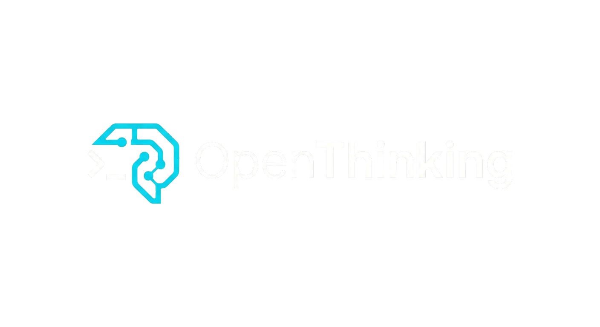

<p align="center">
  
</p>

<h1 align="center">OpenThinking</h1>

<p align="center">
  The first multi-LLM agent orchestration framework for building pipelines, orchestrators, and collaborative AI workflows.
</p>

<p align="center">
  Build multi-LLM systems with shared context, access policies, and reusable skills across any provider.
</p>

<p align="center">
  <a href="https://www.npmjs.com/package/openthk">
    
  </a>
  <a href="./LICENSE">
    
  </a>
  <a href="https://nodejs.org/">
    = 20" />
  </a>
  
</p>

<p align="center">
  <a href="#installation">Install</a> •
  <a href="#quick-start">Quick Start</a> •
  <a href="#features">Features</a> •
  <a href="#architecture">Architecture</a> •
  <a href="https://github.com/sicora-dev/Open-Thinking">Repository</a>
</p>

<p align="center">
  English • <a href="./README.es.md">Español</a> • <a href="./README.fr.md">Français</a>
</p>

---

```yaml
# openthk.pipeline.yaml
name: feature-development
version: "1.0"

providers:
  - anthropic
  - openai

stages:
  planning:
    provider: anthropic
    model: claude-opus-4-5-20250520
    skill: core/arch-planner@1.0
    context:
      read: ["input.*"]
      write: ["plan.*"]

  develop:
    provider: openai
    model: gpt-4o
    skill: core/code-writer@1.0
    context:
      read: ["input.*", "plan.*"]
      write: ["code.*"]
    depends_on: [planning]

  testing:
    provider: anthropic
    model: claude-sonnet-4-20250514
    skill: core/test-gen@1.0
    context:
      read: ["plan.*", "code.*"]
      write: ["test.*"]
    depends_on: [develop]
```

## Table of Contents

- [Features](#features)
- [Requirements](#requirements)
- [Installation](#installation)
- [Quick Start](#quick-start)
- [CLI Reference](#cli-reference)
  - [Interactive REPL](#interactive-repl)
  - [One-Shot Commands](#one-shot-commands)
  - [REPL Slash Commands](#repl-slash-commands)
- [Pipeline Configuration](#pipeline-configuration)
  - [Full YAML Schema](#full-yaml-schema)
  - [Execution Modes](#execution-modes)
  - [Provider Resolution](#provider-resolution)
  - [Context Namespaces](#context-namespaces)
  - [Failure Handling](#failure-handling)
- [Providers](#providers)
  - [Supported Providers](#supported-providers)
  - [Provider Setup](#provider-setup)
  - [Custom Providers](#custom-providers)
  - [Provider Resilience](#provider-resilience)
- [Skills](#skills)
  - [Skill Structure](#skill-structure)
  - [Skill Manifest](#skill-manifest)
  - [Tool Permissions](#tool-permissions)
  - [Built-in Skills](#built-in-skills)
- [Built-in Tools](#built-in-tools)
- [Agent Loop](#agent-loop)
- [Context Store](#context-store)
- [Policy Engine](#policy-engine)
- [Workspace Structure](#workspace-structure)
- [Architecture](#architecture)
- [Development](#development)
- [License](#license)

## Features

- **Multi-LLM orchestration** — Assign different models to different stages. Opus plans, GPT-4o codes, Sonnet tests.
- **Two execution modes** — Sequential (DAG with parallel independent stages) or orchestrated (an LLM dynamically delegates to agents).
- **Shared context store** — SQLite-backed key-value store with namespace-based access control. Stages declare what they can read and write.
- **18+ providers** — OpenAI, Anthropic, Google, Mistral, xAI, DeepSeek, Groq, Together, Fireworks, OpenRouter, Perplexity, Cohere, Azure, Bedrock, Ollama, LM Studio, llama.cpp.
- **Reusable skills** — Package prompts and tool permissions as portable skill definitions. Use built-in skills or create your own.
- **Declarative policies** — Rate limits, cost caps, and audit logging defined in the pipeline YAML.
- **Provider resilience** — Exponential backoff with jitter, token-bucket rate limiting, model fallback chains on rate limit exhaustion.
- **Interactive REPL** — Run `openthk` to open an interactive shell with slash commands, tab completion, and natural language pipeline execution.
- **Package-manager friendly CLI** — Install with `npm`, `pnpm`, or `bun`. Optionally compile a standalone binary for local distribution.

## Requirements

- Node.js >= 20
- macOS or Linux
- [Bun](https://bun.sh) >= 1.1.0 for local development and release builds

## Installation

```bash
# Global install
bun install -g openthk
npm install -g openthk
pnpm add -g openthk

# One-shot execution
bunx openthk --help
npx openthk --help
pnpm dlx openthk --help

# From source
git clone https://github.com/sicora-dev/Open-Thinking.git
cd Open-Thinking
bun install
bun run build         # npm package CLI -> dist/cli/index.cjs
bun run build:binary  # optional standalone binary -> dist/openthk
```

## Quick Start

```bash
# 1. Initialize a new project
openthk init my-project
cd my-project

# 2. Configure your LLM providers (interactive wizard with arrow-key navigation)
openthk
# then inside the REPL:
/providers setup

# 3. Type a prompt to execute the default pipeline
> Build a REST API for a todo app with CRUD endpoints
```

Or run a pipeline directly without the REPL:

```bash
openthk run -p openthk.pipeline.yaml -i "Build a REST API for a todo app"
```

## CLI Reference

### Interactive REPL

```bash
openthk
```

Opens an interactive shell. Type natural language to execute the loaded pipeline, or use slash commands to configure providers, inspect stages, and manage pipelines.

The REPL automatically resolves a pipeline on startup in this order:

1. Active pipeline set via `/pipeline switch <name>`
2. Default pipeline set via `/pipeline default <name>`
3. Auto-detect `openthk.pipeline.yaml` or `pipeline.yaml` in the working directory

### One-Shot Commands

#### `openthk init [name]`

Scaffold a new project.

```bash
openthk init my-project    # Create in new directory
openthk init               # Initialize in current directory
```

Creates:
- `.openthk/pipelines/default.yaml` — Starter pipeline template
- `.openthk/project.md` — Project description (shared context for all stages)
- `.openthk/stages/` — Per-stage instructions
- `.openthk/history/` — Execution history logs
- `.openthk/learned/` — Learnings from past runs
- `skills/` — Local skill definitions
- `openthk.pipeline.yaml` — Root pipeline file (backward compat)

#### `openthk run`

Execute a pipeline.

```bash
openthk run -p <path> -i <prompt> [options]
```

| Flag | Description |
|---|---|
| `-p, --pipeline <path>` | Path to pipeline YAML file (required) |
| `-i, --input <text>` | Input prompt for the pipeline (required) |
| `-s, --stage <name>` | Run a single stage only |
| `--dry-run` | Show the execution plan without running |
| `--skills-dir <path>` | Skills directory (default: `skills/` next to pipeline) |

Examples:

```bash
# Run full pipeline
openthk run -p openthk.pipeline.yaml -i "Build a REST API for user management"

# Run a single stage
openthk run -p pipeline.yaml -i "Write unit tests" --stage testing

# Preview execution plan
openthk run -p pipeline.yaml -i "Refactor auth module" --dry-run
```

#### `openthk validate`

Validate a pipeline YAML file without executing it.

```bash
openthk validate [-f <path>]
```

| Flag | Description |
|---|---|
| `-f, --file <path>` | Pipeline file path (default: `openthk.pipeline.yaml`) |

Checks: YAML syntax, required fields, stage dependency graph (circular deps), provider references, and policy configuration.

#### `openthk provider`

Manage providers from one-shot CLI.

```bash
# List providers defined in a pipeline
openthk provider list [-f <path>]

# Test a provider connection
openthk provider test <name> [-f <path>]
```

| Subcommand | Description |
|---|---|
| `list` | List all providers in the pipeline with their resolved base URLs |
| `test <name>` | Send a test request to verify the provider is reachable and the API key works |

#### `openthk context`

Manage the shared context store.

```bash
# Inspect all entries (or filter by prefix)
openthk context inspect [-p <prefix>] [-d <db-path>]

# Clear all context
openthk context clear -y [-d <db-path>]
```

| Flag | Description |
|---|---|
| `-p, --prefix <prefix>` | Filter entries by key prefix (e.g., `plan.`) |
| `-d, --db <path>` | Database path (default: `.openthk/context.db`) |
| `-y, --yes` | Skip confirmation prompt for clear |

### REPL Slash Commands

| Command | Aliases | Description |
|---|---|---|
| `/help` | `/h`, `/?` | Show all available commands |
| `/pipeline` | `/p` | Show current pipeline design (stages, dependencies, models) |
| `/pipeline list` | | List all available pipelines (project + user level) |
| `/pipeline switch <name>` | | Switch to a different pipeline |
| `/pipeline add <path> [project\|user]` | | Register a pipeline YAML file |
| `/pipeline remove <name> [project\|user]` | | Remove a registered pipeline |
| `/pipeline default <name> <project\|user\|clear>` | | Set or clear the default pipeline |
| `/pipeline load <path>` | | Load a pipeline YAML from a file path |
| `/pipeline refresh [name]` | | Reload pipeline from disk |
| `/providers setup` | | Interactive provider setup wizard (arrow-key navigation) |
| `/providers list` | `/provider list` | List all globally configured API keys |
| `/providers remove <id>` | `/provider rm <id>` | Remove a provider's API key |
| `/model` | `/m` | Show model assignment per stage |
| `/stages` | `/s` | Show stage dependency graph |
| `/skills` | | List available skills in the skills directory |
| `/context inspect` | `/ctx inspect` | Show context store entries |
| `/context clear` | `/ctx clear` | Clear the context store |
| `/clear` | | Clear the terminal |
| `/exit` | `/quit`, `/q` | Exit the REPL |

## Pipeline Configuration

### Full YAML Schema

```yaml
name: string                    # Pipeline name (required)
version: string                 # Semver version (required)
mode: sequential | orchestrated # Execution mode (default: sequential)

context:                        # Optional — defaults shown
  backend: sqlite | postgres    # Storage backend (default: sqlite)
  vector: embedded | qdrant     # Vector search backend (default: embedded)
  ttl: string                   # Context expiration (default: "7d")

providers:                      # Required — at least one
  - openai                      # Catalog name → auto-resolved
  - anthropic
  - ollama
  - id: my-custom               # Custom provider (not in catalog)
    base_url: https://api.example.com/v1
    api_key: ${MY_API_KEY}      # Environment variable interpolation

stages:                         # Required — at least one
  [stage_name]:
    provider: string            # Must match a name from providers list (required)
    model: string               # Model identifier (required)
    skill: string               # Skill reference: namespace/name@version
    context:
      read: string[]            # Glob patterns for readable context keys
      write: string[]           # Glob patterns for writable context keys
    depends_on: string[]        # Stage dependencies (sequential mode)
    max_tokens: number          # Max output tokens per LLM request
    temperature: number         # Sampling temperature (0–2)
    timeout: number             # Request timeout in seconds (default: 120)
    max_iterations: number      # Max agent loop iterations (default: 50)
    role: orchestrator          # Marks as orchestrator (orchestrated mode only)
    allowed_tools: string[]     # Override skill's default tool permissions
    fallback_models: string[]   # Fallback models on rate limit exhaustion
    on_fail:
      retry_stage: string       # Stage to re-run on failure
      max_retries: number       # Max retry attempts
      inject_context: string    # Context key to inject failure details

policies:                       # Optional
  global:
    rate_limit: string          # Rate limit per stage (e.g., "100/hour")
    audit_log: boolean          # Enable audit logging
    cost_limit: string          # Cost cap per run (e.g., "$50/run")
```

### Execution Modes

#### Sequential (default)

Stages run in the order defined by `depends_on`. Independent stages (no shared dependencies) run in parallel.

```yaml
stages:
  planning:
    provider: anthropic
    model: claude-sonnet-4-20250514
    # no depends_on → runs first

  develop:
    provider: openai
    model: gpt-4o
    depends_on: [planning]       # waits for planning

  lint:
    provider: openai
    model: gpt-4o-mini
    depends_on: [planning]       # also waits for planning, but runs in parallel with develop

  testing:
    provider: anthropic
    model: claude-sonnet-4-20250514
    depends_on: [develop, lint]  # waits for both
```

Execution plan:
```
Layer 1:  planning
Layer 2:  develop, lint          (parallel)
Layer 3:  testing
```

#### Orchestrated

One stage is marked `role: orchestrator`. It receives a `delegate` tool and decides dynamically which agents to invoke and in what order. All other stages are available as agents.

```yaml
mode: orchestrated

stages:
  orchestrator:
    provider: anthropic
    model: claude-opus-4-5-20250520
    role: orchestrator
    skill: core/orchestrator@1.0
    context:
      read: ["*"]
      write: ["orchestrator.*"]
    timeout: 600

  architect:
    provider: anthropic
    model: claude-sonnet-4-20250514
    skill: core/arch-planner@1.0
    context:
      read: ["input.*", "*.output"]
      write: ["architect.*"]
    allowed_tools: [read_file, list_files, search_files]

  coder:
    provider: openai
    model: gpt-4o
    skill: core/code-writer@1.0
    context:
      read: ["input.*", "architect.*"]
      write: ["code.*"]

  tester:
    provider: openai
    model: gpt-4o
    skill: core/test-writer@1.0
    context:
      read: ["*"]
      write: ["test.*"]
```

The orchestrator calls agents via the `delegate` tool:

```
delegate(agent: "architect", task: "Analyze the requirements and propose a database schema")
→ runs the architect's full agent loop
→ output stored in context as architect.output
→ orchestrator reads the result and decides next step

delegate(agent: "coder", task: "Implement the schema from the architect's plan")
→ runs the coder's full agent loop
→ ...
```

Agents can be called multiple times with different tasks. Each agent respects its own skill, tools, and context permissions.

### Provider Resolution

Providers in the YAML are declared as names. The parser resolves them automatically:

1. **Base URL** — Looked up from the built-in provider catalog (`src/config/provider-catalog.ts`)
2. **API key** — Looked up from `~/.openthk/providers.json` (configured via `/providers setup`)
3. **Fallback** — If not in global config, checks the environment variable (e.g., `OPENAI_API_KEY`)

Users never need to write `type`, `base_url`, or `api_key` in the YAML for known providers.

Custom providers not in the catalog use the object form:

```yaml
providers:
  - id: my-llm
    base_url: https://api.example.com/v1
    api_key: ${MY_LLM_KEY}
```

### Context Namespaces

Keys use dot notation. Stages declare read/write access with glob patterns.

| Pattern | Matches |
|---|---|
| `input.*` | `input.prompt`, `input.files`, etc. |
| `plan.*` | `plan.architecture`, `plan.decisions`, etc. |
| `code.*` | `code.files`, `code.summary`, etc. |
| `test.*` | `test.results`, `test.failures`, etc. |
| `*.output` | `architect.output`, `coder.output`, etc. |
| `*` | Everything |

A stage trying to read or write outside its declared patterns gets a hard policy error.

### Failure Handling

```yaml
stages:
  testing:
    provider: openai
    model: gpt-4o
    on_fail:
      retry_stage: develop      # Re-run the develop stage
      max_retries: 3            # Up to 3 retries
      inject_context: test.failures  # Pass failure details to the retried stage
```

When a stage fails, the executor can re-run a previous stage with the failure context injected, creating a feedback loop.

## Providers

### Supported Providers

**Cloud**:

| ID | Provider | Example Models |
|---|---|---|
| `openai` | OpenAI | `gpt-4o`, `gpt-4o-mini`, `o1`, `o3-mini` |
| `anthropic` | Anthropic | `claude-opus-4-5-20250520`, `claude-sonnet-4-20250514`, `claude-haiku-4-5-20251001` |
| `google` | Google AI | `gemini-2.5-pro`, `gemini-2.5-flash` |
| `mistral` | Mistral AI | `mistral-large-latest`, `codestral-latest` |
| `xai` | xAI | `grok-3`, `grok-3-mini` |
| `deepseek` | DeepSeek | `deepseek-chat`, `deepseek-reasoner` |
| `groq` | Groq | `llama-3.3-70b-versatile`, `mixtral-8x7b-32768` |
| `together` | Together AI | `meta-llama/Llama-3-70b-chat-hf` |
| `fireworks` | Fireworks AI | `accounts/fireworks/models/llama-v3p1-70b-instruct` |
| `openrouter` | OpenRouter | Any model via unified API |
| `perplexity` | Perplexity | `sonar-pro`, `sonar` |
| `cohere` | Cohere | `command-r-plus`, `command-r` |

**Cloud Infrastructure**:

| ID | Provider | Notes |
|---|---|---|
| `azure` | Azure OpenAI | Enterprise OpenAI deployments |
| `bedrock` | AWS Bedrock | Claude, Llama, Titan via AWS |

**Local**:

| ID | Provider | Default URL |
|---|---|---|
| `ollama` | Ollama | `http://localhost:11434` |
| `lmstudio` | LM Studio | `http://localhost:1234/v1` |
| `llamacpp` | llama.cpp | `http://localhost:8080/v1` |

### Provider Setup

API keys are stored globally in `~/.openthk/providers.json` (file permissions: `0o600`). They persist across all projects.

```bash
# Interactive setup (recommended)
openthk
/providers setup
# → arrow-key selection of providers
# → API key input (masked with bullets)

# List configured providers
/providers list

# Remove a provider
/providers remove openai
```

Alternatively, set API keys via environment variables:

```bash
export OPENAI_API_KEY=sk-...
export ANTHROPIC_API_KEY=sk-ant-...
```

Resolution order: global config (`~/.openthk/providers.json`) > environment variable.

### Custom Providers

Any OpenAI-compatible API can be used as a custom provider:

```yaml
providers:
  - id: my-llm
    base_url: https://api.example.com/v1
    api_key: ${MY_LLM_KEY}

stages:
  coder:
    provider: my-llm
    model: my-model-name
```

### Provider Resilience

All provider calls include built-in resilience:

**Retry with backoff** — Failed requests are retried with exponential backoff and jitter. Retriable conditions: HTTP 429 (rate limit), 502/503 (server errors), network errors (ETIMEDOUT, ECONNRESET). The `Retry-After` header is respected when present.

| Setting | Default |
|---|---|
| Max retries | 3 |
| Base delay | 1s |
| Max delay | 60s |
| Jitter | 500ms |

**Rate limiting** — Token-bucket algorithm throttles requests per provider to avoid 429 errors proactively. Each provider gets an independent bucket that refills continuously.

**Model fallback** — When a model is rate-limited after all retries are exhausted, the executor tries the next model in the `fallback_models` chain:

```yaml
stages:
  coder:
    provider: openai
    model: gpt-4o
    fallback_models:
      - gpt-4o-mini
      - gpt-3.5-turbo
```

**Token tracking** — Cumulative prompt and completion tokens are tracked per stage for cost calculation and policy enforcement.

## Skills

### Skill Structure

A skill is a directory containing two files:

```
skills/core/arch-planner/
├── prompt.md       # System prompt sent to the LLM
└── skill.yaml      # Manifest: metadata, tool permissions, constraints
```

The `prompt.md` is injected as the system prompt for the stage. The `skill.yaml` declares what tools the skill needs and what context keys it reads/writes.

### Skill Manifest

```yaml
name: arch-planner
version: "1.0"
description: Analyzes requirements and produces a technical architecture plan.

context:
  reads: ["input.*"]
  writes: ["planner.*"]

# Tool permissions — enforced at the registry level.
# If a tool isn't listed, the LLM cannot call it.
allowed_tools:
  - read_file
  - list_files
  - search_files

constraints:
  min_tokens: 4000
  recommended_models: [claude-opus-4-5-20250520, gpt-4o]
```

### Tool Permissions

There are no hardcoded stage types. Each skill author decides what their skill can do. Tool access is enforced at the tool registry level — if a tool isn't in the allowed list, the LLM cannot invoke it regardless of what it requests.

**Resolution order** (first match wins):

1. Pipeline YAML `allowed_tools` — User override, full control
2. Skill `skill.yaml` `allowed_tools` — Skill author's default
3. All tools — Fallback if neither defines it

Example override in the pipeline:

```yaml
stages:
  coder:
    skill: core/code-writer@1.0
    allowed_tools: [read_file, list_files]   # restrict: no write_file or run_command
```

### Built-in Skills

| Skill | Description | Default Tools |
|---|---|---|
| `core/arch-planner@1.0` | Analyzes requirements and produces a technical plan | `read_file`, `list_files`, `search_files` |
| `core/code-writer@1.0` | Implements code based on a plan | `read_file`, `write_file`, `list_files`, `run_command`, `search_files` |
| `core/test-writer@1.0` | Generates tests for implemented code | `read_file`, `write_file`, `list_files`, `run_command`, `search_files` |
| `core/orchestrator@1.0` | Orchestrates multi-agent workflows | `delegate` (auto-injected) |

## Built-in Tools

Each stage in the agent loop has access to these filesystem tools (subject to skill permissions):

### `read_file`

Read the contents of a file.

| Parameter | Type | Description |
|---|---|---|
| `path` | string | File path relative to project root |

Returns the file contents as a string. Files larger than 100KB are truncated. Path traversal outside the project root is blocked.

### `write_file`

Create or overwrite a file.

| Parameter | Type | Description |
|---|---|---|
| `path` | string | File path relative to project root |
| `content` | string | File contents |

Creates parent directories automatically. Returns the number of bytes written.

### `list_files`

List files and directories.

| Parameter | Type | Default | Description |
|---|---|---|---|
| `path` | string | `.` | Directory to list |
| `recursive` | boolean | `false` | Recurse into subdirectories |

Returns newline-separated paths. Directories have a `/` suffix. Skips `node_modules` and `.git`. Limited to 500 entries.

### `run_command`

Execute a shell command.

| Parameter | Type | Default | Description |
|---|---|---|---|
| `command` | string | — | Shell command to run |
| `timeout_ms` | number | `30000` | Timeout in milliseconds |

Returns combined stdout and stderr. Output truncated at 50KB. Runs in the project working directory.

### `search_files`

Search file contents with regex.

| Parameter | Type | Default | Description |
|---|---|---|---|
| `pattern` | string | — | Regular expression to search for |
| `path` | string | `.` | Directory to search in |
| `glob` | string | — | File filter (e.g., `*.ts`, `*.py`) |

Returns matches in `path:line_number: matched_line` format. Limited to 100 matches.

### `delegate` (orchestrated mode only)

Invoke an agent stage dynamically. Only available to the orchestrator.

| Parameter | Type | Description |
|---|---|---|
| `agent` | string | Stage name to invoke |
| `task` | string | Task description / prompt |

Runs the agent's full agent loop and returns its final output. The output is also written to the context store under `<agent>.output`.

## Agent Loop

Each stage executes an iterative agent loop: send a prompt to the LLM, execute any tool calls it returns, feed the results back, and repeat until the LLM stops requesting tools or a limit is reached.

### Token Efficiency

**Working memory** — Instead of accumulating the full message history (which grows quadratically in tokens), the loop maintains a compressed working memory (action log + model notes). Before each LLM call, the context is rebuilt as `[task + working memory] + [last exchange only]`.

**Tool output truncation** — Large tool outputs (>2000 lines or 50KB) are truncated to the first 200 lines + last 100 lines with an omission notice. This prevents a single large `run_command` or `read_file` from consuming the entire context window.

### Safety Mechanisms

**Doom loop detection** — If the LLM makes 3 consecutive identical tool calls, the loop returns the cached result instead of re-executing, breaking infinite loops.

**Soft stop** — As `max_iterations` approaches, the loop triggers a wind-down sequence that asks the model to summarize its work and stop cleanly, avoiding abrupt termination mid-task.

**Cancellation** — Ctrl+C during pipeline execution propagates an `AbortSignal` that cleanly cancels the running agent loop.

### Configuration

| Option | Default | Description |
|---|---|---|
| `max_iterations` | 50 | Maximum LLM round-trips per stage |
| `timeout` | 120 | Seconds per individual LLM request |
| `max_tokens` | — | Max output tokens per LLM response |
| `temperature` | — | Sampling temperature (0–2) |

### Output

Each agent loop produces:

```typescript
type AgentLoopResult = {
  finalContent: string;        // Last assistant message
  totalUsage: TokenUsage;      // { prompt, completion, total }
  iterations: number;          // Number of LLM calls made
  stopReason: "done" | "cancelled" | "max_iterations" | "token_limit" | "error";
  workSummary: {
    filesWritten: string[];
    commandsRun: string[];
  };
};
```

## Context Store

SQLite-backed key-value store where stages share data. Each entry has a key (dot notation), value, creator, and optional TTL.

```
plan.architecture  →  "## Architecture\n\nWe'll use a layered..."  (created by: planning)
code.files         →  "src/api/routes.ts, src/api/handlers.ts"     (created by: develop)
test.results       →  "12 passed, 0 failed"                        (created by: testing)
```

Access is controlled by glob patterns declared in each stage's `context.read` and `context.write` fields. The policy engine evaluates every read/write operation before it executes.

Context expires based on the pipeline's `ttl` setting (default: 7 days). Expired entries are removed on next access.

## Policy Engine

Policies are defined in the pipeline YAML and enforced automatically:

```yaml
policies:
  global:
    rate_limit: "100/hour"     # Max LLM requests per stage per hour
    audit_log: true            # Log all context reads/writes and tool calls
    cost_limit: "$50/run"      # Max cost per pipeline execution
```

**Context access control** — Each stage declares `read` and `write` glob patterns. The policy engine evaluates every context operation. A stage trying to read `code.*` when it only has `read: ["input.*"]` gets a `PolicyError` with code `READ_DENIED`.

**Rate limiting** — Enforced per stage. Exceeding the limit produces a `RATE_EXCEEDED` error.

**Cost tracking** — Token usage is tracked per stage and accumulated. Exceeding `cost_limit` stops the pipeline with a `COST_EXCEEDED` error.

## Workspace Structure

### Global (`~/.openthk/`)

Created on first run. Stores configuration that persists across all projects.

```
~/.openthk/
├── providers.json       # API keys (0o600 permissions)
├── pipelines/           # User-level pipeline definitions
├── learned/             # Global learnings across projects
└── user.md              # User preferences (shared with all stages)
```

### Per-Project (`.openthk/`)

Created by `openthk init`. Stores project-specific state.

```
.openthk/
├── pipelines/           # Project pipeline definitions
│   └── default.yaml
├── project.md           # Project "soul" — description shared with all stages
├── stages/              # Per-stage instructions (e.g., coder.md)
├── context.db           # SQLite context store
├── history/             # Execution logs (one file per run)
├── learned/             # Project-specific learnings
├── active-pipeline      # Pointer to current pipeline name
└── .gitignore           # Auto-excludes context.db, history/, active-pipeline
```

## Architecture

```
src/
├── cli/                  # CLI entry point and interactive REPL
│   ├── commands/         # One-shot commands (init, run, validate, provider, context)
│   └── repl/             # Interactive REPL shell, slash commands, tab completion
├── config/               # Global configuration (~/.openthk/)
│   ├── global-config     # API key storage (providers.json)
│   ├── provider-catalog  # Built-in provider definitions (18+ providers)
│   └── setup-wizard      # Interactive provider setup with arrow-key navigation
├── core/
│   └── events/           # Event bus for stage lifecycle (start, complete, error, tool call)
├── pipeline/
│   ├── parser/           # YAML parser + validator + provider resolver
│   └── executor/         # DAG executor, agent loop, working memory, doom loop detection
├── providers/
│   ├── adapters/         # Protocol adapters (OpenAI-compat, Anthropic translation, Ollama)
│   └── resilience/       # Retry (exponential backoff), rate limiter (token bucket), token tracker
├── tools/                # Built-in tools (read_file, write_file, list_files, run_command, search_files, delegate)
├── context/
│   └── store/            # SQLite key-value store with namespace access control
├── skills/               # Skill loader (prompt.md + skill.yaml)
├── policies/
│   └── engine/           # Policy evaluation (glob matching, rate limits, cost caps)
├── workspace/            # .openthk/ and ~/.openthk/ management, history, learnings
└── shared/               # Types, Result<T,E> pattern, errors, logger
```

All LLM providers are accessed through an OpenAI-compatible interface. Providers that don't support it natively (Anthropic) use a translation adapter. This means adding a new provider only requires mapping its API to the OpenAI chat completion format.

Error handling uses the `Result<T, E>` pattern throughout — no exceptions in core logic:

```typescript
type Result<T, E = Error> = { ok: true; value: T } | { ok: false; error: E };

const result = await parsePipeline("pipeline.yaml");
if (!result.ok) {
  console.error(result.error.message);
  return;
}
const config = result.value;
```

## Development

```bash
# Install dependencies
bun install

# Run in development mode
bun run dev

# Run with arguments
bun run dev -- run -p pipeline.yaml -i "test prompt"

# Run tests
bun test

# Run a specific test file
bun test src/pipeline/parser/pipeline-parser.test.ts

# Type checking
bun run typecheck

# Lint
bun run lint

# Format
bun run format

# Build npm package CLI
bun run build
# → dist/cli/index.cjs

# Optional standalone binary
bun run build:binary
# → dist/openthk
```

## License

MIT — see [LICENSE](LICENSE).
